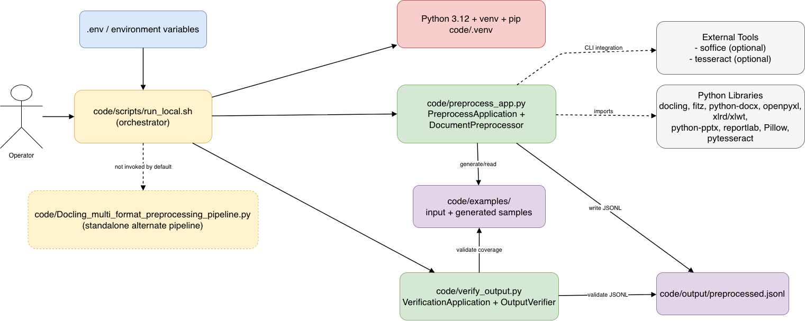
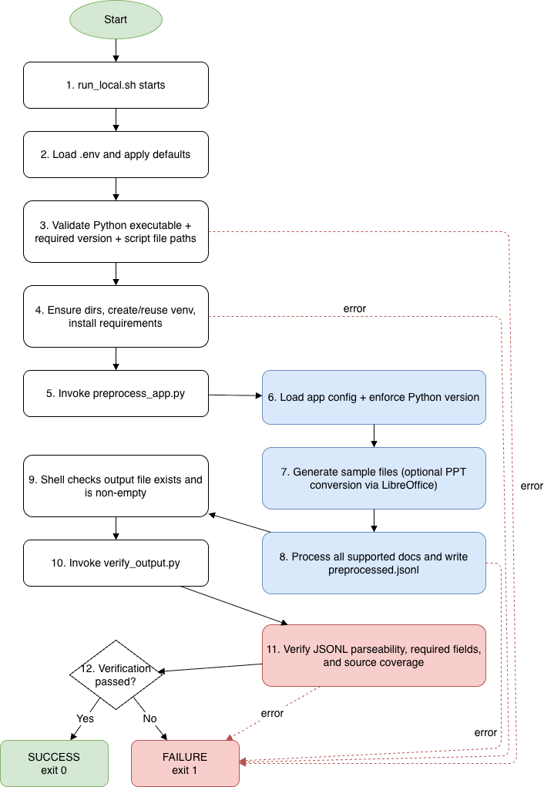

# Architecture Documentation: Docling Preprocessor Factory

_Note: This architecture documentation was developed with the help of AI._

## 1. System Overview

### Purpose
The system provides a local document preprocessing pipeline that:
- Generates representative example files (PDF, DOCX, XLS/XLSX, PPTX, optional PPT).
- Extracts content unit-wise for chunking workflows.
- Produces normalized JSONL output with metadata and OCR text (when available).
- Verifies output integrity and source coverage.

### Core Responsibilities
- Environment-driven runtime configuration.
- Python version enforcement (3.12).
- Dependency/bootstrap orchestration.
- Multi-format parsing and extraction.
- Output validation against schema and source files.

### Architectural Style
Modular batch-processing pipeline with script orchestration:
- **Orchestrator layer**: `code/scripts/run_local.sh`
- **Application layer**: `code/preprocess_app.py`
- **Verification layer**: `code/verify_output.py`
- **Optional alternate pipeline module**: `code/Docling_multi_format_preprocessing_pipeline.py` (not invoked by default orchestration)

---

## 2. Static View (Structural Architecture)

### Module/Package Structure
```text
docling_preprocessor_factory/
  .env_template
  QUICKSTART.md
  README.md
  code/
    scripts/
      run_local.sh
      requirements.txt
    preprocess_app.py
    verify_output.py
    Docling_multi_format_preprocessing_pipeline.py
    examples/
    output/
```

### Class and Component Responsibilities

| Module | Class/Component | Responsibility |
|---|---|---|
| `code/scripts/run_local.sh` | Shell orchestration | Loads `.env`, sets defaults, enforces Python version, prepares venv/dependencies, runs preprocessing app, runs verifier, enforces non-zero exit on failure. |
| `code/preprocess_app.py` | `AppConfig`, `AppConfigLoader` | Resolves runtime config from CLI/environment. |
| `code/preprocess_app.py` | `PythonVersionEnforcer` | Enforces exact major/minor Python version. |
| `code/preprocess_app.py` | `LibreOfficeService` | Headless format conversion for legacy office formats (mainly PPT/PPTX path). |
| `code/preprocess_app.py` | `OCRService` | Tesseract-backed OCR extraction from image bytes. |
| `code/preprocess_app.py` | `SampleFileGenerator` | Creates sample input corpus under configured input directory. |
| `code/preprocess_app.py` | `MarkdownFormatter` | Converts worksheet tabular data to markdown tables. |
| `code/preprocess_app.py` | `RecordFactory` | Builds normalized JSONL records. |
| `code/preprocess_app.py` | `DocumentPreprocessor` | Dispatches processing by file extension and writes JSONL records. |
| `code/preprocess_app.py` | `PreprocessApplication`, `ApplicationEntryPoint` | Top-level app lifecycle (config, validation, generation, processing). |
| `code/verify_output.py` | `VerificationConfig`, `VerificationConfigLoader` | Resolves verifier config from CLI/environment. |
| `code/verify_output.py` | `OutputVerifier` | Validates output existence, JSONL parseability, required fields, and one-to-one source coverage. |
| `code/verify_output.py` | `VerificationApplication`, `ApplicationEntryPoint` | Verifier lifecycle and exit behavior. |
| `code/Docling_multi_format_preprocessing_pipeline.py` | `PreprocessingPipeline` and related classes | Standalone Docling-centric extraction pipeline with environment-driven CLI wrapper. |

### Key Abstractions
- **Immutable config dataclasses**: `AppConfig`, `VerificationConfig`.
- **Service abstractions**: OCR and LibreOffice behaviors encapsulated in dedicated service classes.
- **Record abstraction**: canonical JSONL schema via `RecordFactory`.
- **Dispatcher abstraction**: extension-based routing in `DocumentPreprocessor._process_file`.

### External Dependencies
- Python libraries: `docling`, `PyMuPDF` (`fitz`), `python-docx`, `openpyxl`, `xlrd`, `xlwt`, `python-pptx`, `reportlab`, `Pillow`, `pytesseract`.
- External executables: `python3.12`, optional `soffice` (LibreOffice), optional `tesseract`.

### Configuration and Environment Handling
- Shell loads `${DOC_PREPROCESS_ENV_FILE}` (default `<project>/.env`) and exports runtime defaults.
- Python modules accept CLI arguments but are designed to resolve missing values from environment variables.
- Required/critical values are validated early and fail-fast.

### Design Patterns Used
- **Factory**: `CLIParserFactory`, `RecordFactory` (and converter factory in alternate module).
- **Service Object**: `OCRService`, `LibreOfficeService`.
- **Template-like orchestration**: shell script defines deterministic startup lifecycle.
- **Data Transfer Object**: dataclasses for immutable config transport.

---

## 3. Dynamic View (Runtime Behavior)

### Main Execution Flow
1. `run_local.sh` loads `.env` and applies defaults.
2. Validates required Python executable and exact version.
3. Ensures expected files/directories exist.
4. Writes pinned `requirements.txt`.
5. Creates/reuses virtual environment and installs dependencies.
6. Invokes `preprocess_app.py` with resolved parameters.
7. Checks output file existence and non-empty content.
8. Invokes `verify_output.py`.
9. Prints success message or exits non-zero on any failure.

### Key Workflow A: Preprocessing (Step-by-Step)
1. `ApplicationEntryPoint` parses CLI args.
2. `AppConfigLoader` resolves all config values.
3. `PythonVersionEnforcer` validates runtime version.
4. `SampleFileGenerator` creates sample files in configured input directory.
5. `DocumentPreprocessor.preprocess_all` scans supported files.
6. Per file, dispatches to format-specific handler:
   - PDF: Docling markdown per page + optional OCR per page.
   - DOCX: document-level text + OCR on embedded images.
   - PPTX/PPT: slide-level text + OCR on slide images (PPT may require conversion).
   - XLSX/XLS: sheet-level markdown table extraction + best-effort OCR for XLSX images.
7. Writes one JSON object per unit to configured JSONL output.

### Key Workflow B: Verification (Step-by-Step)
1. `VerificationConfigLoader` resolves verifier config.
2. Version check via `PythonVersionEnforcer`.
3. `OutputVerifier` validates:
   - examples directory exists,
   - output JSONL exists,
   - JSON lines are valid,
   - required fields exist in each record,
   - every supported file in examples is represented in output via `source_file_path`.
4. Raises runtime errors on first violation; shell exits non-zero.

### Data Flow Between Components

| Source | Target | Data |
|---|---|---|
| `.env` / shell defaults | `run_local.sh` | Runtime settings and paths. |
| `run_local.sh` | `preprocess_app.py` | CLI parameters and inherited environment. |
| `preprocess_app.py` | `code/examples/*` | Generated sample documents/images. |
| `code/examples/*` | `DocumentPreprocessor` | Raw document content across supported formats. |
| `DocumentPreprocessor` | `code/output/preprocessed.jsonl` | Unit-wise records: source path, input format, unit number/type, markdown text, OCR text, metadata. |
| `run_local.sh` | `verify_output.py` | Validation command + config values. |
| `verify_output.py` | Exit code to shell | Pass/fail result for pipeline execution. |

### Lifecycle Management
- Process lifecycle is short-lived and batch-oriented.
- Venv is persistent across runs unless manually recreated.
- Output JSONL is rewritten on each preprocessing run.
- Resource cleanup is implicit via context managers and process termination.

### Error Handling Strategy
- Shell: `set -euo pipefail` + `trap` for immediate failure visibility.
- Preprocessor: collects per-file processing errors, logs all, then fails run.
- Verifier: fails on first structural/semantic validation error.
- Top-level Python entry points catch exceptions and return exit code `1`.

### Integration Points
- **Docling API** for PDF markdown extraction (with optional OCR pipeline options when available).
- **LibreOffice CLI (`soffice`)** for legacy conversion paths.
- **Tesseract CLI via `pytesseract`** for OCR.
- **Filesystem** as system boundary for input/output artifacts.

---

## 4. Configuration & Environment

### Environment Variables

#### Orchestration and Runtime (primarily `run_local.sh`)
| Variable | Purpose |
|---|---|
| `DOC_PREPROCESS_ENV_FILE` | Path to `.env` file loaded by shell bootstrap. |
| `DOC_PREPROCESS_SCRIPT_DIR` | Script directory override. |
| `DOC_PREPROCESS_CODE_DIR` | Code directory base path. |
| `DOC_PREPROCESS_PROJECT_DIR` | Project root path. |
| `DOC_PREPROCESS_REQUIRED_PYTHON` | Required `major.minor` Python version (default `3.12`). |
| `DOC_PREPROCESS_PYTHON_BIN` | Python executable used to build/run venv (default `python3.12`). |
| `DOC_PREPROCESS_EXAMPLES_DIR` | Input/examples directory. |
| `DOC_PREPROCESS_OUTPUT_DIR` | Output directory. |
| `DOC_PREPROCESS_OUTPUT_JSONL` | Output JSONL path. |
| `DOC_PREPROCESS_VENV_DIR` | Virtual environment path. |
| `DOC_PREPROCESS_REQUIREMENTS_FILE` | Requirements file path written by shell. |
| `DOC_PREPROCESS_APP_FILE` | Preprocessing app entry script path. |
| `DOC_PREPROCESS_VERIFY_FILE` | Verification script path. |
| `DOC_PREPROCESS_LIBREOFFICE_BIN` | Optional LibreOffice executable path. |
| `DOC_PREPROCESS_TESSERACT_BIN` | OCR executable name/path. |
| `DOC_PREPROCESS_SUPPORTED_EXTENSIONS` | Comma-separated extension allowlist. |
| `DOC_PREPROCESS_REQUIRED_FIELDS` | Comma-separated required JSONL fields for verifier. |
| `DOC_PREPROCESS_SAMPLE_IMAGE_NAME` | Generated sample image filename. |
| `DOC_PREPROCESS_SAMPLE_PDF_NAME` | Generated sample PDF filename. |
| `DOC_PREPROCESS_SAMPLE_DOCX_NAME` | Generated sample DOCX filename. |
| `DOC_PREPROCESS_SAMPLE_XLSX_NAME` | Generated sample XLSX filename. |
| `DOC_PREPROCESS_SAMPLE_XLS_NAME` | Generated sample XLS filename. |
| `DOC_PREPROCESS_SAMPLE_PPTX_NAME` | Generated sample PPTX filename. |
| `DOC_PREPROCESS_SAMPLE_PPT_NAME` | Generated sample PPT filename. |

#### Alternate Standalone Module (`Docling_multi_format_preprocessing_pipeline.py`)
| Variable | Purpose |
|---|---|
| `DOC_PREPROCESS_PIPELINE_INPUT_FILE` | Input file path for standalone pipeline CLI. |
| `DOC_PREPROCESS_PIPELINE_OUTPUT_FILE` | Output JSONL file path for standalone pipeline CLI. |

### Runtime Assumptions
- Python 3.12 is available and selected.
- Local filesystem is writable for configured input/output/venv paths.
- Network access may be required for dependency installation.
- LibreOffice and Tesseract are optional; behavior degrades accordingly.

### Deployment Considerations
- Containerization strategy: **Not derivable from source.**
- Service hosting/topology: **Not derivable from source.**
- CI/CD pipeline definition: **Not derivable from source.**

---

## 5. Extension Points

| Extension Area | Where to Extend | How |
|---|---|---|
| New file format support | `DocumentPreprocessor._process_file` + new `_process_<format>` method | Add extension mapping and handler implementation, then include extension in `DOC_PREPROCESS_SUPPORTED_EXTENSIONS`. |
| Output schema enrichment | `RecordFactory.build` and per-handler metadata | Add fields centrally and ensure verifier `DOC_PREPROCESS_REQUIRED_FIELDS` aligns if fields become mandatory. |
| OCR behavior | `OCRService` | Replace extractor implementation or support alternate OCR engines behind same service API. |
| Conversion strategy | `LibreOfficeService` | Add additional conversion targets/options without changing callers. |
| Validation rules | `OutputVerifier` | Add semantic validations (e.g., unit ordering, format-specific constraints). |
| Input generation policy | `SampleFileGenerator` | Add/remove sample artifacts while preserving app flow. |
| Config model | `AppConfigLoader` / `VerificationConfigLoader` | Introduce new env vars/CLI flags with explicit validation. |

---

## Static Component Diagram (draw.io XML)



## Dynamic Flow Diagram (draw.io XML)

